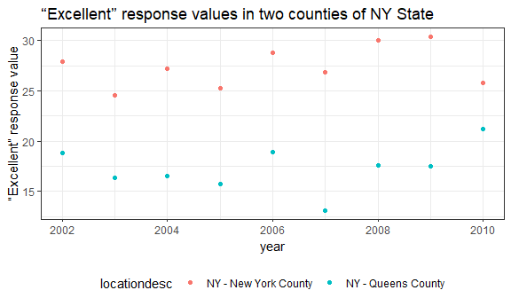

p8105\_hw2\_yh3094
================
Yun He
September 27, 2018

Problem 1
=========

Import and clean NYC transit dataset
------------------------------------

``` r
transit_data = 
  read_csv("./data/NYC_Transit_Subway_Entrance_And_Exit_Data.csv") %>%
  janitor::clean_names() %>% 
  select(line:entry, vending, ada) %>% 
  mutate(entry = recode(entry, 'YES' = TRUE, 'NO' = FALSE)) 
```

    ## Parsed with column specification:
    ## cols(
    ##   .default = col_character(),
    ##   `Station Latitude` = col_double(),
    ##   `Station Longitude` = col_double(),
    ##   Route8 = col_integer(),
    ##   Route9 = col_integer(),
    ##   Route10 = col_integer(),
    ##   Route11 = col_integer(),
    ##   ADA = col_logical(),
    ##   `Free Crossover` = col_logical(),
    ##   `Entrance Latitude` = col_double(),
    ##   `Entrance Longitude` = col_double()
    ## )

    ## See spec(...) for full column specifications.

``` r
transit_data
```

    ## # A tibble: 1,868 x 19
    ##    line  station_name station_latitude station_longitu~ route1 route2
    ##    <chr> <chr>                   <dbl>            <dbl> <chr>  <chr> 
    ##  1 4 Av~ 25th St                  40.7            -74.0 R      <NA>  
    ##  2 4 Av~ 25th St                  40.7            -74.0 R      <NA>  
    ##  3 4 Av~ 36th St                  40.7            -74.0 N      R     
    ##  4 4 Av~ 36th St                  40.7            -74.0 N      R     
    ##  5 4 Av~ 36th St                  40.7            -74.0 N      R     
    ##  6 4 Av~ 45th St                  40.6            -74.0 R      <NA>  
    ##  7 4 Av~ 45th St                  40.6            -74.0 R      <NA>  
    ##  8 4 Av~ 45th St                  40.6            -74.0 R      <NA>  
    ##  9 4 Av~ 45th St                  40.6            -74.0 R      <NA>  
    ## 10 4 Av~ 53rd St                  40.6            -74.0 R      <NA>  
    ## # ... with 1,858 more rows, and 13 more variables: route3 <chr>,
    ## #   route4 <chr>, route5 <chr>, route6 <chr>, route7 <chr>, route8 <int>,
    ## #   route9 <int>, route10 <int>, route11 <int>, entrance_type <chr>,
    ## #   entry <lgl>, vending <chr>, ada <lgl>

The dataset contains variables for line, station name, station latitude / longitude, routes served, entry, vending, entrance type, and ADA compliance. I first imported the dataset using `read_csv`, cleaned all variable names using `janitor::clean_names`, and then preserved the variables that I wanted using `select`, and finally, I converted the entry variable from character (YES vs NO) to a logical variable (TRUE vs FALSE) using `recode`. After all the cleaning steps above, the final dataset contains 1868 rows and 19 columns. In my opinion, these data are untidy because the route variable is spread across 11 columns.

Calculate the sum of distinct stations
--------------------------------------

``` r
nrow(distinct(transit_data, line, station_name))
```

    ## [1] 465

There are 465 distinct stations.

Calculate the sum of ADA compliant stations
-------------------------------------------

``` r
transit_data %>% 
  filter(ada == TRUE) %>% 
  distinct(line, station_name) %>% 
  nrow()
```

    ## [1] 84

There are 84 ADA compliant stations.

Calculate the proportion of stations without vending allow entrance
-------------------------------------------------------------------

``` r
entrance_without_vending = nrow(filter(transit_data, vending == "NO" & entry == TRUE))
sum_without_vending = nrow(filter(transit_data, vending == "NO"))
## calculate the proportion
entrance_without_vending/sum_without_vending
```

    ## [1] 0.3770492

The proportion of station entrances / exits without vending allow entrance is 0.38.

Reformat data
-------------

The code chunk below reformats the dataset `transit_data` so that route number and route name are distinct variables.

``` r
transit_data_reformat = 
  transit_data %>% 
  gather(key = route_number, value = route_name, route1:route11)
transit_data_reformat
```

    ## # A tibble: 20,548 x 10
    ##    line  station_name station_latitude station_longitu~ entrance_type entry
    ##    <chr> <chr>                   <dbl>            <dbl> <chr>         <lgl>
    ##  1 4 Av~ 25th St                  40.7            -74.0 Stair         TRUE 
    ##  2 4 Av~ 25th St                  40.7            -74.0 Stair         TRUE 
    ##  3 4 Av~ 36th St                  40.7            -74.0 Stair         TRUE 
    ##  4 4 Av~ 36th St                  40.7            -74.0 Stair         TRUE 
    ##  5 4 Av~ 36th St                  40.7            -74.0 Stair         TRUE 
    ##  6 4 Av~ 45th St                  40.6            -74.0 Stair         TRUE 
    ##  7 4 Av~ 45th St                  40.6            -74.0 Stair         TRUE 
    ##  8 4 Av~ 45th St                  40.6            -74.0 Stair         TRUE 
    ##  9 4 Av~ 45th St                  40.6            -74.0 Stair         TRUE 
    ## 10 4 Av~ 53rd St                  40.6            -74.0 Stair         TRUE 
    ## # ... with 20,538 more rows, and 4 more variables: vending <chr>,
    ## #   ada <lgl>, route_number <chr>, route_name <chr>

Calculate distinct stations that serve the A train
--------------------------------------------------

``` r
transit_data_A = 
  transit_data_reformat %>% 
  filter(route_name == 'A')
nrow(distinct(transit_data_A, line, station_name))
```

    ## [1] 60

There are 60 distinct stations that serve the A train.

Calculate ADA compliant stations that serve the A train
-------------------------------------------------------

``` r
filter(transit_data_A, ada == TRUE) %>% 
  distinct(line, station_name) %>% 
  nrow()
```

    ## [1] 17

Of the stations that serve the A train, 17 are ADA compliant.

Problem 2
=========

Import and clean the Mr. Trash Wheel sheet
------------------------------------------

``` r
wheel_data = 
  read_excel("./data/HealthyHarborWaterWheelTotals2017-9-26.xlsx",
             sheet = "Mr. Trash Wheel", range = cell_cols("A:N")) %>% 
  janitor::clean_names() %>% 
  filter(!is.na(dumpster)) %>% 
  mutate(sports_balls = round(sports_balls)) %>% 
  mutate(sports_balls = as.integer(sports_balls))
wheel_data
```

    ## # A tibble: 216 x 14
    ##    dumpster month  year date                weight_tons volume_cubic_ya~
    ##       <dbl> <chr> <dbl> <dttm>                    <dbl>            <dbl>
    ##  1        1 May    2014 2014-05-16 00:00:00        4.31               18
    ##  2        2 May    2014 2014-05-16 00:00:00        2.74               13
    ##  3        3 May    2014 2014-05-16 00:00:00        3.45               15
    ##  4        4 May    2014 2014-05-17 00:00:00        3.1                15
    ##  5        5 May    2014 2014-05-17 00:00:00        4.06               18
    ##  6        6 May    2014 2014-05-20 00:00:00        2.71               13
    ##  7        7 May    2014 2014-05-21 00:00:00        1.91                8
    ##  8        8 May    2014 2014-05-28 00:00:00        3.7                16
    ##  9        9 June   2014 2014-06-05 00:00:00        2.52               14
    ## 10       10 June   2014 2014-06-11 00:00:00        3.76               18
    ## # ... with 206 more rows, and 8 more variables: plastic_bottles <dbl>,
    ## #   polystyrene <dbl>, cigarette_butts <dbl>, glass_bottles <dbl>,
    ## #   grocery_bags <dbl>, chip_bags <dbl>, sports_balls <int>,
    ## #   homes_powered <dbl>

Read and clean precipitation data
---------------------------------

The code chunk below first read and clean precipitation data for 2016 and 2017 separately, then combine these two datasets, and convert month to a character variable.

``` r
precipiation_data_2016 = 
  read_excel("./data/HealthyHarborWaterWheelTotals2017-9-26.xlsx", 
             sheet = "2016 Precipitation", range = cell_rows(2:14)) %>%
  janitor::clean_names() %>%
  filter(!is.na(total)) %>% 
  mutate(year = 2016) 

precipitation_data_2017 = 
  read_excel("./data/HealthyHarborWaterWheelTotals2017-9-26.xlsx", 
             sheet = "2017 Precipitation", range = cell_rows(2:14)) %>%
  janitor::clean_names() %>%
  filter(!is.na(total)) %>% 
  mutate(year = 2017)

precipitation_data = 
  bind_rows(precipiation_data_2016, precipitation_data_2017) %>% 
  mutate(month = month.name[month]) %>% 
  select(year, everything()) ## to put year in the first column
precipitation_data
```

    ## # A tibble: 20 x 3
    ##     year month     total
    ##    <dbl> <chr>     <dbl>
    ##  1  2016 January    3.23
    ##  2  2016 February   5.32
    ##  3  2016 March      2.24
    ##  4  2016 April      1.78
    ##  5  2016 May        5.19
    ##  6  2016 June       3.2 
    ##  7  2016 July       6.09
    ##  8  2016 August     3.96
    ##  9  2016 September  4.53
    ## 10  2016 October    0.62
    ## 11  2016 November   1.47
    ## 12  2016 December   2.32
    ## 13  2017 January    2.34
    ## 14  2017 February   1.46
    ## 15  2017 March      3.57
    ## 16  2017 April      3.99
    ## 17  2017 May        5.64
    ## 18  2017 June       1.4 
    ## 19  2017 July       7.09
    ## 20  2017 August     4.44

The Mr. Trash Wheel sheet contains 216 observations.And it contains variables for month, year, date, weight, volume, plastic bottles, polystyrene, cigarette\_butts, glass bottles, grocery bags, chip bags, sports balls and homes powered.

The precipitation dataset contains 20 observations. And it contains variables for year, month and the total precipitaion.

The total precipitation in 2017 is 29.93. The median number of sports balls in a dumpster in 2016 is 26.

Problem 3
=========

Load the data from the `p8105.datasets` package
-----------------------------------------------

``` r
devtools::install_github("p8105/p8105.datasets")
```

    ## Skipping install of 'p8105.datasets' from a github remote, the SHA1 (21f5ad1c) has not changed since last install.
    ##   Use `force = TRUE` to force installation

``` r
library(p8105.datasets)
data(brfss_smart2010)
```

Clean the BRFSS dataset
-----------------------

The code chunk below cleans the BRFSS dataset and creates a new variable showing the proportion of responses that were “Excellent” or “Very Good”.

``` r
brfss_data = 
  janitor::clean_names(brfss_smart2010) %>% 
  filter(topic == "Overall Health") %>% 
  select(-(class:question), -sample_size, -(confidence_limit_low:geo_location)) %>% 
  spread(key = response, value = data_value) %>% 
  janitor::clean_names() %>% 
  mutate(excellent_or_very_good = excellent + very_good)
```

Answer questions related to locations
-------------------------------------

``` r
nrow(distinct(brfss_data, locationdesc))
```

    ## [1] 404

``` r
nrow(distinct(brfss_data, locationabbr))
```

    ## [1] 51

``` r
which.max(table(brfss_data$locationabbr))
```

    ## NJ 
    ## 32

There are 404 unique locations included in the dataset. Every state is represented. The state NJ is observed the most.

Calculate the median “Excellent” response value in 2002
-------------------------------------------------------

``` r
median(filter(brfss_data, year == 2002)$excellent, na.rm = TRUE)
```

    ## [1] 23.6

The median of the “Excellent” response value in 2002 is 23.6.

Make a histogram of “Excellent” response values in 2002
-------------------------------------------------------

``` r
brfss_data %>% 
  filter(year == 2002) %>% 
  ggplot(aes(x = excellent)) +
  geom_histogram() +
  labs(
    title = "The histogram of “Excellent” response value in 2002",
    x = "“Excellent” response value"
  )
```

    ## `stat_bin()` using `bins = 30`. Pick better value with `binwidth`.

    ## Warning: Removed 2 rows containing non-finite values (stat_bin).


Make a scatterplot
------------------

The code chunk below makes a scatterplot showing the proportion of “Excellent” response values in New York County and Queens County (both in NY State) in each year from 2002 to 2010.

``` r
brfss_data %>% 
  filter(locationdesc == "NY - New York County" | locationdesc == "NY - Queens County") %>%
  ggplot(aes(x = year, y = excellent, color = locationdesc)) +
  geom_point() +
  labs(
    title = "“Excellent” response values in two counties of NY State",
    y = "“Excellent” response value"
  )
```


